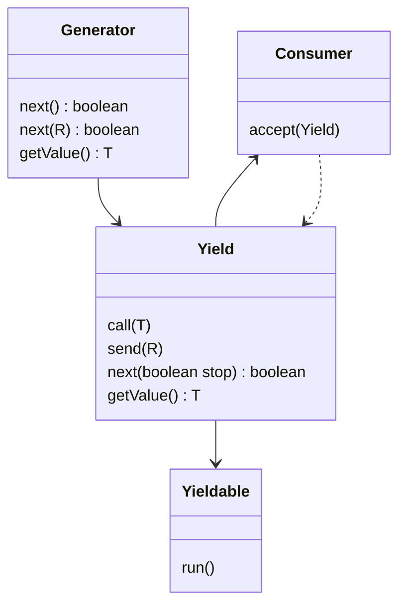
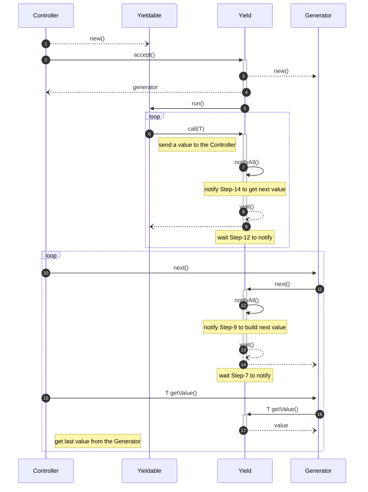

UIA-SIM for Java, DESim4J
===

[](https://travis-ci.org/uia4j/uia-sim)
[](https://codecov.io/gh/uia4j/uia-sim)
[](https://www.codacy.com/gh/uia4j/uia-sim/dashboard?utm_source=github.com&amp;utm_medium=referral&amp;utm_content=uia4j/uia-sim&amp;utm_campaign=Badge_Grade)
[](LICENSE)

DESim4J is a Java port of [SimPy](https://simpy.readthedocs.io/en/latest/), __process-based discrete event simulation__ framework.

DESim4J aims to port the concepts used in SimPy to the Java world. Because there is no `yield` keyword in Java, the framework also implements a __yield-like__ API in package `uia.cor` to meet some coroutine scenarios.

The [ROAD](https://github.com/uia4j/uia-road) is a sub-project that build a abstract simulator of the manufacturing factory.

[API](https://uia4j.github.io/uia-sim/index.html)

## package uia.cor
The package provides __yield-like__ API. The main concept is

```java
Generator gen = Yield.accept(yield -> ::function);
```

* Yield
  * ___yield___.call(Object) - pass a value to paired `Generator`.
  * ___yield___.close() - stop iteration.

* Generator
  * ___gen___.next() - notify ___::function___ to prepare next value.
  * ___gen___.errorNext() - notify ___::function___ to prepare next value.
  * ___gen___.getValue() - Get the value from `yield.setValue(Object)`
  * ___gen___.error(ex) - send back an exception.
  * ___gen___.send(Object) - send back a value to ___yield___.
  * ___gen___.close() - stop ___yield___ iterable.

Below is a simple workflow of Yield-Generator:

```java
public class YieldTest {

    @Test
    public void testCallFor() {
        // 1
        Generator<Integer> gen = Yield.accept(this::callFor); 
            // 2, 5
            while(gen.next()) {
                // 4
                System.out.println("value=" + gen.getValue());
        }
    }

    /**
     * iterable work
     */
    public void callFor(Yield<Integer> yield) {
        for(int i = 0; i < 10; i++) {
            // 3
            yield.call(i);
        }
    }
}
```

1. `Generator<Integer> gen = Yield.accept(this::callFor)` - Create a `Yield` object and pass to `callFor` method. Return paired `Generator`.
2. `gen.next()` - Ask if there is a new value or not.
3. `yield.call(i)` - Pass a new value to the generator and block until invoking `gen.next()` again.
4. `gen.getValue()` - Get the new value passed by `yield.call(i)`.
5. `while(gen.next())` - Repeat until completing the `for` loop.
 
Use `Yield2Way` if iteration needs to get a result from `yield.call(value)`.

```java
public class Yield2WayTest {

    @Test
    public void testSum2() {
        Generator2Way<Integer, Integer> gen = Yield2Way.accept(this::sum2);
        int i = 0;
        // 4
        while(gen.next()) {
            // 2
            i = gen.getValue();
            System.out.println("value=" + i);
            // 3
            gen.send(i * i);
        }
    }

    /**
     * iterable work
     */
    public void sum2(Yield2Way<Integer, Integer> yield) {
        int i = 1;
        int sum = 0;
        while(i <= 10) {
            // 1, 5
            int v = yield.call(i++);    // waiting a result
            sum += v;
        }
        System.out.println("  sum=" + sum);
    }
}
```
1. `yield.call(i++)` - Pass a new value to the generator and block until invoking  `gen.next()` again.
2. `gen.getValue()` - Get the new value passed by `yield.call(i)`.
3. `gen.send(i * i)` - Send back a result but __step 1 is still blocking__.
4. `gen.next()` - Ask if there is a new value or not and __release step 1__ at the same time.
5. `int v = yield.call(i++)` - Get the result passed by `gen.send(i * i)`.

### Class Diagram



### Sequence Diagram




## package uia.sim
The package is core framework of __process-based discrete event simulation__.

Some documents

* [Core Design](CORE-SIM.md)
* [Examples](CORE-SIM-EXAMPLES.md)

### Core Concept

1. Create a event stream
 ```mermaid
 flowchart LR;
     id1[[*E00]]-->E20;
     E20-->E50;
     E50-->E90;
 ```

2. Execute head event E00, and create a new event E55. The event stream becomes
 ```mermaid
 flowchart LR;
     id1[[*E20]]-->E50;
     E50-->id2([E55]);
     id2([E55])-->E90;
 ```

3. Execute head event E20, and create a new event E53. The event stream becomes
 ```mermaid
 flowchart LR;
     id1[[*E50]]-->id2([E53]);
     id2([E53])-->id3([E55]);
     id3([E55])-->E90;
 ```

4. Execute all events with ordering.
 ```mermaid
 flowchart LR;
     id1[[*E53]]-->id2([E55]);
     id2([E55])-->E90;
 ```
 ```mermaid
 flowchart LR;
     id1[[*E55]]-->E90;
 ```
 ```mermaid
 flowchart LR;
     id1[[*E90]];
 ```

## Test Case

Below is a Java test case compares with Python version.

### Python
``` Python
class School:
    def __init__(self, env):
        self.env = env
        self.class_ends = env.event()
        self.pupil_procs = [env.process(self.pupil()) for i in range(3)]
        self.bell_proc = env.process(self.bell())

    def bell(self):
        while True:
            yield self.env.timeout(45)
            self.class_ends.succeed()
            self.class_ends = self.env.event()
            print()

    def pupil(self):
        while True:
            yield self.class_ends
            print(r' \o/', end='')

env = Environment()
school = School(env)
env.run(200)
```

### Java
``` Java
public class SchoolTest {

    private Env env;

    private Event classEnd;

    public SchoolTest() {
        this.env = new Env();
        this.classEnd = this.env.event("classEnd");
        env.process("pupil-1", this::pupil);
        env.process("pupil-2", this::pupil);
        env.process("pupil-3", this::pupil);
        env.process("bell", this::bell);
    }

    public void bell(Yield<Event> yield) {
        while(yield.isAlive()) {
            yield.call(env.timeout(45));
            this.classEnd.succeed(null);
            this.classEnd = this.env.event("classEnd");
            System.out.println(String.format("\n%3d> bell is ringing...", this.env.getNow()));
        }
    }

    public void pupil(Yield<Event> yield) {
        while(yield.isAlive()) {
            yield.call(this.classEnd);
            System.out.print("\\o/ ");
        }
    }

    @Test
    public void test1() throws Exception {
        this.env.run(200);
    }
}
```

The framework is still building and testing. The next tasks are

1. Add `resources` implementation.
2. More stable of `uia.cor` package.
3. More reasonable Exception control.
4. More test cases to prove the framework.

# Reference
[SimPy Home](https://simpy.readthedocs.io/en/latest/)

[SimPy GitLab](https://gitlab.com/team-simpy/simpy)

[Discrete-Event Simulation Wiki](https://en.wikipedia.org/wiki/Discrete-event_simulation)
